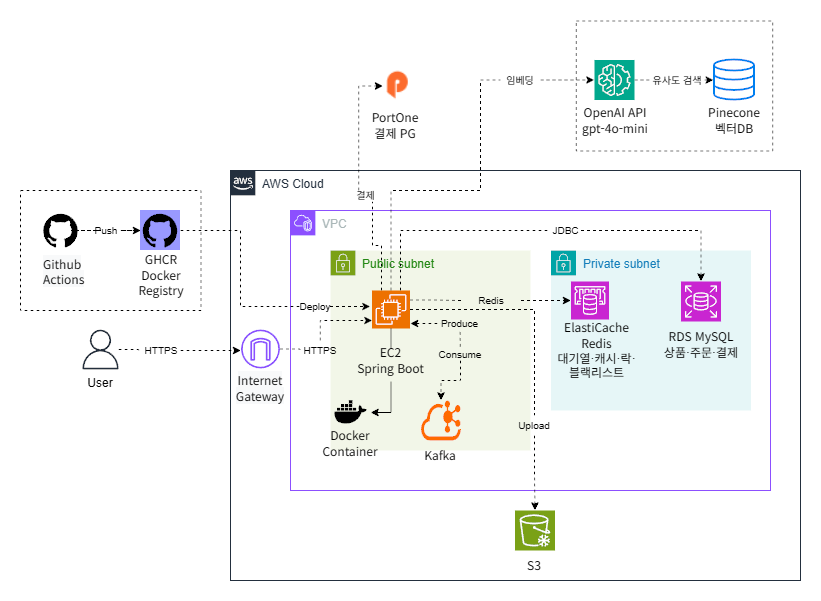
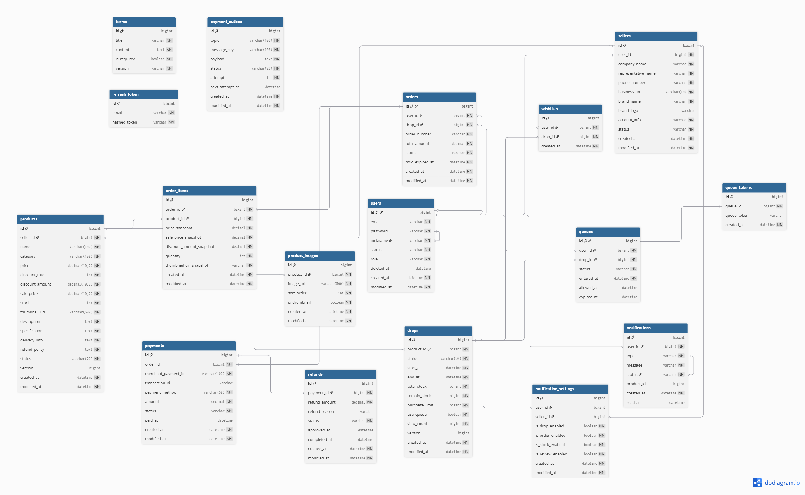

# Dropshop

<div align="center">

# Dropshop

### 한정판 드랍 판매를 위한 고트래픽 대응 커머스 백엔드 플랫폼

<p align="center">
  <a href="https://github.com/3JOTEAM/dropshop/graphs/contributors">
    
  </a>
  <a href="https://github.com/3JOTEAM/dropshop/commits/main">
    
  </a>
  <a href="https://github.com/3JOTEAM/dropshop/network/members">
    
  </a>
  <a href="https://github.com/3JOTEAM/dropshop/stargazers">
    
  </a>
  <a href="https://github.com/3JOTEAM/dropshop/issues">
    
  </a>
  <a href="https://github.com/3JOTEAM/dropshop/blob/main/LICENSE">
    
  </a>
</p>

<p align="center">
  <a href="http://54.116.47.216:8080/swagger-ui/index.html"><strong>Swagger</strong></a>
  ·
  <a href="https://www.figma.com/community/file/1623244235916509008"><strong>Wireframe</strong></a>
  ·
  <a href="https://github.com/3JOTEAM/dropshop/issues"><strong>Report Bug</strong></a>
  ·
  <a href="https://github.com/3JOTEAM/dropshop/issues"><strong>Request Feature</strong></a>
</p>

</div>

## 📖 목차
1. [프로젝트 소개](#-프로젝트-소개)
2. [팀소개](#팀소개)
3. [프로젝트 계기](#프로젝트-계기)
4. [주요기능](#-주요기능)
5. [개발기간](#-개발기간)
6. [기술스택](#-기술스택)
7. [서비스 구조](#서비스-구조)
8. [와이어프레임](#와이어프레임)
9. [API 명세서](#api-명세서)
10. [ERD](#erd)
11. [프로젝트 파일 구조](#프로젝트-파일-구조)
12. [Trouble Shooting](#trouble-shooting)

## 👨‍🏫 프로젝트 소개

Dropshop은 드롭 기반 커머스 서비스를 위한 백엔드 프로젝트입니다. 일반 상품 조회부터 판매자 상품/드랍 운영, 주문·결제·환불, 대기열, 알림, 통계, 추천 기능까지 하나의 서비스 안에서 제공할 수 있도록 설계했습니다.

실시간 트래픽이 몰릴 수 있는 드랍 판매 상황을 고려해 Redis, Kafka, 대기열 로직을 포함했고, 판매자 운영 기능과 관리자 통계 기능도 함께 다루는 구조로 구현했습니다.

## 팀소개

| 역할 | 이름 | GitHub |
| --- | --- | --- |
| 팀장 | 강동혁 | [youzting](https://github.com/youzting) |
| 팀원 | 김규범 | [gb96-dev](https://github.com/gb96-dev) |
| 팀원 | 김재진 | [JJK3187](https://github.com/JJK3187) |
| 팀원 | 이재환 | [0xc0de1dea](https://github.com/0xc0de1dea?tab=repositories) |

## 프로젝트 계기

한정 수량 상품이나 특정 시간에만 오픈되는 드랍 판매는 일반적인 커머스보다 순간 트래픽과 동시성 이슈가 크게 발생합니다. 이 프로젝트는 이런 문제를 실제 서비스 관점에서 다뤄 보기 위해 시작했습니다.

단순한 상품 CRUD를 넘어서 대기열, 주문/결제, 환불, 판매자 관리, 통계, 추천 기능까지 포함한 구조를 직접 설계하고 구현하며 실무형 백엔드 아키텍처를 경험하는 것을 목표로 했습니다.

## 💜 주요기능

| 기능 | 설명 |
|------|------|
| **회원 / 인증** | 회원가입, 로그인, JWT 발급, 토큰 갱신, 로그아웃, 비밀번호 변경 |
| **판매자 관리** | 판매자 신청, 관리자 승인/거절, 판매자 정보 수정 |
| **상품 관리** | 상품 등록·수정·삭제, 이미지 등록, 상태 변경, 버전 관리(낙관적 락) |
| **드랍(Drop)** | 드랍 생성, 상태 전환(UPCOMING → ACTIVE → ENDED), 자동 스케줄러 |
| **대기열** | Redis ZSET 기반 선착순 대기열, admissionToken 발급, 주문 인터셉터 검증 |
| **위시리스트** | 드랍별 위시리스트 등록/삭제, Redis 캐싱, QueryDSL 조회 |
| **SSE 실시간 알림** | 드랍 오픈 시 위시리스트 등록 유저에게 SSE Push 알림 |
| **주문 / 결제** | 주문 생성(HOLD), PortOne 결제 준비·완료, 아웃박스 패턴, 재고 확정 |
| **환불** | 환불 요청, PortOne 취소 API 연동, 재고 복원 |
| **통계 / 대시보드** | 판매자 매출 추이, 카테고리별 매출, 인기 상품(Redis 랭킹) |
| **AI 추천** | 자연어 질의 → OpenAI 임베딩 → Pinecone 벡터 검색 |
| **알림 내역** | 수신 알림 목록 조회, 읽음 처리 |


## ⏲️ 개발기간

- 2026.04.07(화) ~ 2026.05.14(목)

## 📚️ 기술스택

### ✔️ Language

- 

### ✔️ Backend

- 
- 
- 
- 
- 
- 
- 
- 

### ✔️ Security

- 
- 

### ✔️ Database

- 
- 
- 

### ✔️ Message Broker

- 

### ✔️ Version Control

- 
- 

### ✔️ IDE

- 

### ✔️ Infra / Deploy

- 
- 
- 
- 
- 

### ✔️ CI/CD

- 

### ✔️ Test / Docs

- 
- 
- 
- 
- 

### ✔️ Open API

- 

### ✔️ Collaboration

- 
- 
- 

## 서비스 구조

- Client가 상품/드랍 조회, 주문, 결제, 알림 요청을 보냅니다.
- Spring Boot 애플리케이션이 인증, 상품, 드랍, 주문, 결제, 환불, 통계 API를 처리합니다.
- MySQL은 주문, 상품, 회원, 판매자, 환불 등 핵심 데이터를 저장합니다.
- Redis는 캐시와 대기열 처리, 일부 실시간성 데이터 저장에 사용됩니다.
- Kafka는 이벤트 기반 비동기 처리와 서비스 간 흐름 분리에 활용됩니다.




## 와이어프레임

- Figma: [Dropshop Wireframe](https://www.figma.com/community/file/1623244235916509008)

## API 명세서

- Swagger UI: [http://54.116.47.216:8080/swagger-ui/index.html](http://54.116.47.216:8080/swagger-ui/index.html)


주요 API 범위:

- 인증 / 회원: 로그인, 회원가입, 비밀번호 변경, 탈퇴
- 판매자 / 상품 / 드랍: 판매자 신청, 상품 관리, 드랍 관리
- 주문 / 결제 / 환불: 주문 생성, 결제 승인, 웹훅, 환불 처리
- 알림 / 통계 / 추천: SSE 알림, 대시보드, 통계, 자연어 추천

## ERD



주요 도메인:

- User
- Seller
- Product
- Drops
- Order
- OrderItem
- Payment
- Refund
- Wishlist
- Notification

## 프로젝트 파일 구조

```text
src/main/java/com/example/dropshop
├─ common
│  ├─ config
│  ├─ constant
│  ├─ dto
│  ├─ entity
│  ├─ exception
│  ├─ jwt
│  ├─ kafka
│  ├─ lock
│  └─ security
└─ domain
   ├─ admin
   ├─ auth
   ├─ batch
   ├─ dashboard
   ├─ drops
   ├─ notification
   ├─ order
   ├─ payment
   ├─ product
   ├─ queue
   ├─ recommendation
   ├─ refund
   ├─ seller
   ├─ statistics
   ├─ terms
   ├─ user
   └─ wishlist
```

## Trouble Shooting

### 1. 판매자 대시보드 일자 집계 동시 갱신 문제

결제와 환불 이벤트가 같은 날짜 집계를 동시에 갱신하면서 판매자 대시보드 수치 정합성이 흔들릴 수 있었습니다. 판매자별 일자 집계 갱신 구간에 Redis 기반 분산 락을 적용해 동일 집계 레코드에 대한 동시 갱신 충돌을 줄였습니다.

### 2. 주문 취소/복원 경로가 분산되어 재고 복원 누락이 발생할 수 있는 문제

주문 만료, 수동 취소, 결제 실패, 환불 완료처럼 주문 상태가 취소 방향으로 바뀌는 경로가 여러 곳에 흩어져 있었습니다. 이를 `OrderStatusChangedEvent`와 `StockRestoreEvent` 중심으로 통일해 재고 복원 책임을 한 흐름으로 모았고, 경로별 누락 가능성을 줄였습니다.

### 3. Payment 도메인에서 웹훅 중복 처리와 이중 확정이 발생할 수 있는 문제

결제 확정 API 호출과 PG 웹훅이 거의 동시에 들어오면 하나의 주문이 중복 확정될 여지가 있었습니다. 웹훅은 서명 검증 후 처리하고 이미 완료된 결제는 그대로 반환하도록 구성했으며, `orderId` 기준 Redis 분산 락을 적용해 한 시점에 하나의 흐름만 상태를 바꾸도록 제어했습니다.

### 4. Queue 도메인에서 드랍 오픈 시 순간 트래픽 폭주를 직접 처리하기 어려운 문제

드랍 서비스는 특정 시점에 요청이 폭발적으로 몰리기 때문에 즉시 처리 구조만으로는 API 서버와 DB 부하가 급증하고, 재고 처리 지연과 재시도 폭증까지 이어질 수 있었습니다. 이를 해결하기 위해 구매 요청을 바로 재고 로직으로 보내지 않고 Kafka Topic에 적재한 뒤 Consumer가 순차 처리하는 Delay Queue 구조를 도입했습니다.

이 구조를 통해 순간 트래픽을 완충하고, 시스템이 감당 가능한 속도로 요청을 처리하도록 제어했으며, 재처리와 장애 대응도 더 안정적으로 가져갈 수 있었습니다.

- 관련 문서: [순간 트래픽 폭주 환경에서의 동시성 제어 전략](https://www.notion.so/35d2dc3ef51480c680d0c6ecd91a8c3b?pvs=21)

### 5. Auth 도메인에서 JWT 로그아웃 후에도 기존 토큰이 유효한 문제

JWT는 Stateless 구조이기 때문에 로그아웃을 하더라도 이미 발급된 Access Token은 만료 전까지 계속 사용할 수 있는 한계가 있었습니다. 이를 보완하기 위해 로그아웃한 Access Token을 Redis 블랙리스트에 남은 만료 시간만큼 TTL과 함께 저장하고, `JwtAuthenticationFilter`에서 토큰 유효성 검사와 블랙리스트 조회를 함께 수행하도록 구성했습니다.

그 결과 서버 세션 구조로 돌아가지 않으면서도 로그아웃 이후 토큰을 즉시 무효화할 수 있게 했고, 탈취 토큰 재사용 위험도 줄일 수 있었습니다.

### 6. Kafka 이벤트 발행 실패가 핵심 비즈니스 로직 실패로 전파되는 문제

회원가입, 로그인, 판매자 신청 같은 핵심 기능 이후 Kafka 이벤트를 직접 발행하던 초기 구조에서는 브로커 장애나 발행 실패가 서비스 계층까지 전파되어 실제 비즈니스는 성공했는데 API 응답은 실패로 내려갈 수 있었습니다. 이를 해결하기 위해 Kafka 발행 책임을 `EventKafkaProducer`로 분리하고, 발행 실패는 내부 로깅과 모니터링 대상으로만 남기고 상위 서비스 로직에는 전파하지 않도록 격리했습니다.

이렇게 핵심 도메인 로직과 부가 이벤트 처리의 책임을 분리해 Kafka 장애가 회원가입, 로그인, 판매자 신청 같은 핵심 기능 가용성을 직접 해치지 않도록 구성했습니다.
